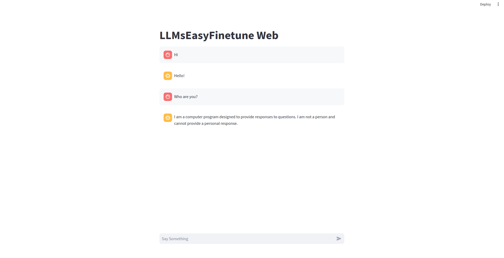

# LLMsEasyFinetune
[](https://github.com/huawei-lin/LLMsEasyFinetune/blob/master/LICENSE)
[](https://www.python.org/downloads/release/python-390/)

This repo is an easy-to-run implementation for finetuning large language models (LLMs) such as llama and gemma, supporting full parameter finetuning, LoRA, and QLoRA.

## Quick Start

Create a new env and install the requirements.
```
conda create -n LLMsEasyFinetune python=3.10
conda activate LLMsEasyFinetune
pip install -r requirements.txt
```
We recommend using `wandb` to monitor the training status.

We provide a [52K alpaca dataset](https://github.com/tatsu-lab/stanford_alpaca/tree/main) in `./data` for model finetuning.

- **Finetuning `llama-2-7b` with QLoRA**

The `run.sh` is a simple example for finetuning `llama-2-7b` with QLoRA.

You can also change the model to `google/gemma-7b`.
```
torchrun --nproc_per_node=1 --master_port=27312 train.py \
    --model_name_or_path meta-llama/Llama-2-7b-hf \
    --data_path ./data/alpaca_data.json \
    --output_dir ./example_output_dir \
    --run_name  example_output \
    --bf16 True \
    --num_train_epochs 5 \
    --per_device_train_batch_size 16 \
    --gradient_accumulation_steps 8 \
    --warmup_steps 300 \
    --save_strategy "epoch" \
    --lr_scheduler_type "constant_with_warmup" \
    --save_total_limit 10 \
    --learning_rate 5e-5 \
    --model_max_length 512 \
    --logging_steps 8 \
    --tf32 True \
    --ddp_find_unused_parameters False \
    --use_lora True \
    --load_in_4bit True \
    --lora_r 8 \
    --lora_alpha 16 \
    --lora_target_modules q_proj v_proj k_proj o_proj
```
We also support `--load_in_8bit True`

You can also use LoRA without quantization by ignoring the flag `load_in_4bit` and `load_in_8bit`.

The flag `lora_target_modules` supports `q_proj`, `v_proj`, `k_proj`, `o_proj`.

You can use `--resume_from_checkpoint ${path_to_lora_checkpoint}` to load your trained lora.

- **Full-parameter Finetuning `gemma-7b`**

If you want to do full-parameter finetuning, you can disable `use_lora` or ignore it.
```
torchrun --nproc_per_node=1 --master_port=27312 train.py \
    --model_name_or_path google/gemma-7b \
    --data_path ./data/alpaca_data.json \
    --output_dir ./example_output_dir \
    --run_name  example_output \
    --bf16 True \
    --num_train_epochs 5 \
    --per_device_train_batch_size 16 \
    --gradient_accumulation_steps 8 \
    --warmup_steps 300 \
    --save_strategy "epoch" \
    --lr_scheduler_type "constant_with_warmup" \
    --save_total_limit 10 \
    --learning_rate 5e-5 \
    --model_max_length 512 \
    --logging_steps 8 \
    --tf32 True \
    --ddp_find_unused_parameters False
```

- **Full-parameter Finetuning `llama-2-7b` with FSDP CPU Offloading**

When GPU Memory is insufficient, you can enable the CPU offloading for FSDP.
  
```
torchrun --nproc_per_node=1 --master_port=27312 train.py \
    --model_name_or_path meta-llama/Llama-2-7b-hf \
    --data_path ./data/alpaca_data.json \
    --output_dir ./example_output_dir \
    --run_name  example_output \
    --bf16 True \
    --num_train_epochs 5 \
    --per_device_train_batch_size 16 \
    --gradient_accumulation_steps 8 \
    --warmup_steps 300 \
    --save_strategy "epoch" \
    --lr_scheduler_type "constant_with_warmup" \
    --save_total_limit 10 \
    --learning_rate 5e-5 \
    --model_max_length 512 \
    --logging_steps 8 \
    --tf32 True \
    --ddp_find_unused_parameters False \
    --fsdp "full_shard auto_wrap offload" \
    --fsdp_transformer_layer_cls_to_wrap 'LlamaDecoderLayer'
```

## Server & Client
You can use `example/server.py` to deploy your model on your server, and use `example/client.py` for inference. Deploying the model on a server and using a client for inference can save a lot of time on loading the model for multiple prompts.

Start by running the server script in `examples` with the following command:
```bash
CUDA_VISIBLE_DEVICES=0 python server.py \
    --model_name_or_path meta-llama/Llama-2-7b-hf \
    --adapter_path /path/to/your/lora/adapter \
    --load_in_4bit True
```
The `adapter_path` and `load_in_4bit` can be ignored if you want to deploy the base model.

After model deploying, you can perform inference by executing `python client.py`.

You can also customize the system prompt or chat history in the script.


## Web UI
Demo: https://llmseasyfinetune-web.streamlit.app

We provide a very simple web UI in `example/web_client.py` as shown in the following screenshot:


Streamlit is needed for web UI: `pip install streamlit`.

Then execute `streamlit run web_client.py`.

The strealim might use `8501` port, you can forward the port of the server to your local by `ssh ${your_server} -L 8501:localhost:8501`.


## References
[0]: [Alpaca: A Strong, Replicable Instruction-Following Model](https://crfm.stanford.edu/2023/03/13/alpaca.html)

[1]: [LLaMA: Open and Efficient Foundation Language Models](https://arxiv.org/abs/2302.13971v1)

[2]: [LoRA: Low-Rank Adaptation of Large Language Models](https://arxiv.org/abs/2106.09685)

[3]: [QLoRA: Efficient Finetuning of Quantized LLMs](https://proceedings.neurips.cc/paper_files/paper/2023/file/1feb87871436031bdc0f2beaa62a049b-Paper-Conference.pdf)

[4]: [Gemma: Introducing new state-of-the-art open models](https://blog.google/technology/developers/gemma-open-models/)

## Author
- [Huawei Lin](https://huaweilin.net/)


